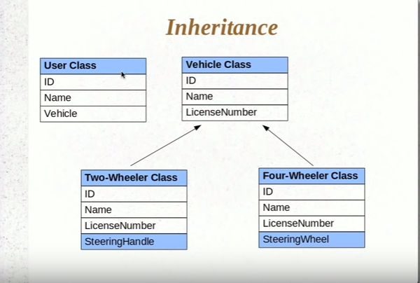

# Inheritance Implementation

Why do we need to map the inheritance since the parent and child class are seperate entities and could be saved seperately?



Consider the above relationships between vehicle and Two/Four wheeler vehicle.

Now If we have a Vehicle object on User Object then at run time we cant decide which foreign key to have in user vehiclke object. Since user table can have only one foreign key relatioship at a time.
To take the benefit of polymorphism we need to implement inheritance relatioship in hibernate also.

When we define each subclass as entities HB creates a single table and 
persist all data in it.

It create an additional column 'Dtype' in the table which denotes
the class name saved.

## SingleTableStrategy

When we don't specify any inheritance mapping strategy this strategy 
is used.

Dtype - descriminator

```java
@Entity
@Inheritance(strategy=InheritanceType.SINGLE_TABLE)
@DiscriminatorColumn(
        name="VEHICLE_TYPE",
        discriminatorType=DiscriminatorType.STRING
)
public class Vehicle {

    @Id@GeneratedValue
    private int vehicleId;
    private String vehicleName;
}

```

```java
@Entity
@DiscriminatorValue("Car")
public class FourWheeler extends Vehicle{

    private String steeringHandle;

}

```

```java
@Entity
@DiscriminatorValue("Bike")
public class TwoWheeler extends Vehicle{

    private String steeringHandle;

}
```
