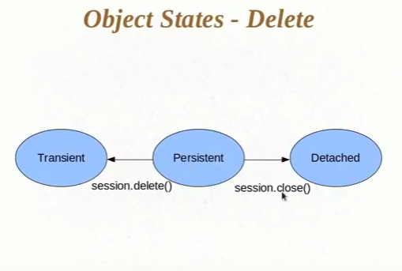

# Transient, Persistent a

## Transient

When HB does not know about this object.

## Persistent

When HB has taken the object it is in Persistent state and HB no tracks each and every change we make to the Persistent object.
HB fires an update query for each and every update we make to the Persistent object.
HB also detects minimum numbers of query to fire to update the object, it does not fire query for each and every update.
The state of the object before committing transaction would be the last state to be saved into the database.
Tracks object as long as session is open.

## Detached

After the tr has committed, HB does not track the object anymore and said to have in detached state.

## Understanding state changes

## **Object states**

### objectStates Read

### UPDATE

Object can be updated in two ways.

1. Create flows - we create a new object then after persisting the object we can update it.
2. Read Flow - We can read object from db then update it since after read object is in persistent state.

### DELETE

This also has two flows.

### Object States

Object becomes persistent when it is attached to the session and it becomes in detached when  it is remove from the session.

--------------------

## persisting detached objectstates2

**Q When may we need to persist detached state.**

Scenario:- Suppose user is interacting with our system and updating its information.
Now suppose when the data is fetched user might take time to update information and then press the update button so we can't keep the session open for that much of time.
So what we do is we do the fetch in one transaction and then update information in another transaction.
Once we close the session the object becomes detached and to update the user information we need to persist it again.

1. When we make the detached object persistent then HB first finds the object from database and then fires the update query.
2. Hibernate fires the update query even if we do not make any change to the detached object and try to persist it. It happens because HB does not know what happened to the object while it was detached. So it fires the update query.
3. We can tell HB to fire update query only when the object is changed and if it has not changed then just make it persistent.
    1. @org.hibernate.annotations.Entity(selectBeforeUpdate=true) `depriciated`. HB first fetched the object and then compares the fetched object with detached object and updates only when the data is different.We should only use this way if we want to only persist the object. But is there is a good chance if object being updated then we should not use this methos as it makes an extra find query to make the object persistent.

-----------------------------------------------------